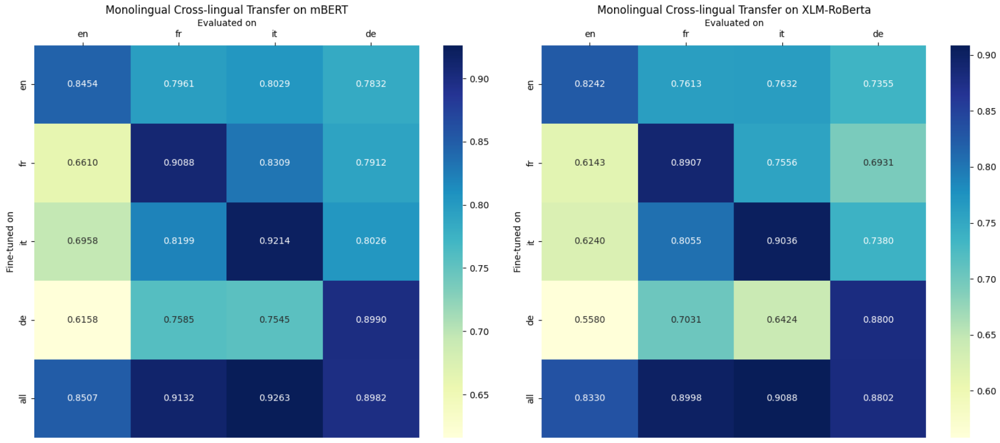

# Multilingual Named Entity Recognition (NER) for Switzerland

## Project Overview

This project focuses on utilizing state-of-the-art multilingual transformers, specifically mBERT and XLM-RoBERTa, for Named Entity Recognition (NER) in Switzerland's unique multilingual setting. The aim is to address the challenges posed by Switzerland's linguistic diversity by evaluating and comparing these models using the PAN-X dataset, which includes data in German, French, Italian, and English.

The results highlight the superiority of mBERT over XLM-RoBERTa in both multilingual and monolingual fine-tuning strategies, providing valuable insights for future advancements in multilingual NLP systems.

## Key Features

- **Comprehensive Multilingual Support**: Supports German, French, Italian, and English for NER tasks.
- **Advanced Transformer Models**: Comparison and analysis of mBERT and XLM-RoBERTa performance.
- **Innovative Training Strategies**: Includes both multilingual and monolingual fine-tuning approaches.
- **Rich Dataset Utilization**: Employs the PAN-X dataset, a multilingual corpus annotated for NER.

## Installation Guide

1. Clone the repository:
   ```bash
   git clone https://github.com/MohamedAlaaAli/SWIZT.git
   cd SWIZT
   ```
2. Install the required dependencies:
   ```bash
   pip install -r requirements.txt
   ```

## Dataset Details

The project leverages the PAN-X (WikiANN) dataset, which provides:

- Annotated entities: Locations (LOC), Persons (PER), and Organizations (ORG).
- Coverage of 176 languages, with specific focus on German, French, Italian, and English.
- Balanced splits for training, validation, and testing.

### IOB2 Format

The dataset uses the IOB2 tagging scheme for entity annotation:

- **B-XXX**: Marks the beginning of an entity of type XXX (e.g., B-PER for the beginning of a person entity).
- **I-XXX**: Marks subsequent tokens of the same entity type (e.g., I-PER for continuing a person entity).
- **O**: Indicates tokens that are not part of any entity.

Example:

```plaintext
Sentence: [John lives in Zurich.]
Tags:     [B-PER O O B-LOC O]
```

This format ensures consistent and interpretable annotations, facilitating robust evaluation.

## Usage Instructions

1. **Prepare Dataset**: Ensure the PAN-X dataset is downloaded and properly organized as per repository guidelines.
2. **Training Models**:
   - Train mBERT or XLM-RoBERTa models with multilingual or monolingual fine-tuning.
   ```bash
   python train.py --model [mBERT|XLM-RoBERTa] --language [all|de|fr|it|en]
   ```
3. **Evaluate Performance**:
   - Evaluate models on specific languages or multilingual settings.
   ```bash
   python evaluate.py --model [mBERT|XLM-RoBERTa] --language [de|fr|it|en]
   ```

## Methodology

1. **Model Architecture**:

   - **Input Layer**: Tokenized text using SentencePiece (XLM-RoBERTa) or WordPiece (mBERT).
   - **Encoder**: Transformer-based encoder generating contextual embeddings for tokens.
   - **Classification Head**: A linear layer mapping embeddings to NER tags.
   - **Loss Function**: Cross-entropy loss with masking for ignored tokens.

2. **Fine-tuning Strategies**:

   - **Multilingual Fine-tuning**: Training on all four languages simultaneously.
   - **Monolingual Fine-tuning**: Training on individual languages to assess cross-lingual capabilities.

3. **Evaluation Metrics**:

   - F1 Score: Evaluated for both in-language and cross-lingual performance.
   - Confusion Matrices: Analyze misclassification patterns, such as confusion between entity types.

## Results and Findings

- **Model Comparison**:

  - mBERT outperformed XLM-RoBERTa in F1 scores across all multilingual and monolingual settings.
  - Superior cross-lingual generalization demonstrated by mBERT.

- **Confusion Matrix**:

  Below is the confusion matrix showcasing the results of monolingual cross-lingual transfer experiments:

  

  **Interpretation**:

  - The diagonal values represent the F1 scores achieved when fine-tuned and evaluated on the same language.
  - Off-diagonal values indicate cross-lingual transfer performance, where a model fine-tuned on one language is evaluated on another.
  - mBERT consistently demonstrates stronger cross-lingual capabilities compared to XLM-RoBERTa, especially in scenarios involving linguistically similar languages like French and Italian.

  **Insights**:

  - Dataset characteristics, model architecture, and pretraining corpus size influence performance.
  - mBERT’s design aligns well with the linguistic requirements of Switzerland’s multilingual context.

## Challenges and Future Work

- Address limitations of existing datasets by incorporating domain-specific multilingual corpora.
- Experiment with alternative transformer models and hyperparameter configurations.
- Extend the study to include additional low-resource languages beyond the Swiss context.

## Acknowledgments

We express our gratitude to:

- Lewis Tunstall, Leandro von Werra, and Thomas Wolf for their book "Natural Language Processing with Transformers."
- Dr. Inas A. Yassine and Samar Alaa for their invaluable guidance throughout this project.

## Contributors

Gratitude goes out to all team members for their valuable contributions to this project.

<div align="left">
    <a href="https://github.com/MohamedAlaaAli">
      
    </a>
 <a href="https://github.com/joyou159">
      
    </a>
    <a href="https://github.com/AhmeddEmad7">
    
  </a>
    <a href="https://github.com/ZiadMeligy">
      
    </a>

